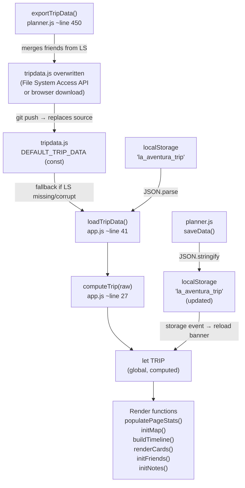

# Data Architecture & Flow

---

## Overview Diagram



---

## localStorage Keys

> **NEVER rename these keys.** Changing them breaks all existing user data silently.

| Key | Owner | Shape | Notes |
|---|---|---|---|
| `la_aventura_trip` | `app.js` + `planner.js` | `{ startDate: "YYYY-MM-DD", stops: Stop[] }` | Saved by planner `saveData()`. Read by `loadTripData()`. |
| `la_aventura_friends` | `app.js` | `Friend[]` | Saved by `saveFriendsToStorage()`. Read by `loadFriends()`. |
| `la_aventura_notes` | `app.js` | `Note[]` | Saved by `saveNotesToStorage()`. Read by `loadNotes()`. |
| `la_aventura_theme` | `app.js` | `"light"` or `"dark"` | Saved by `initThemeToggle()`. |
| `la_aventura_expenses` | `app.js` | `Expense[]` | Budget tracker actual expenses. Key constant `BUDGET_KEY`. |

---

## DEFAULT_TRIP_DATA Schema

Defined in `tripdata.js` as a `const`. Loaded before `app.js` and `planner.js` via `<script>` order.

```js
const DEFAULT_TRIP_DATA = {
  "startDate": "2026-10-23",   // string, YYYY-MM-DD — trip departure date
  "stops": [ /* Stop[] */ ],
  "friends": [ /* Friend[] */ ],
  "notes":   [ /* Note[] */ ]
}
```

Note: `la_aventura_trip` in localStorage stores only `{ startDate, stops }` — **not** friends or notes.  
Friends and notes have their own localStorage keys.

---

## Stop Object Schema

| Field | Type | Example | Stored or Computed |
|---|---|---|---|
| `id` | string | `"lima"`, `"stop_1716313200000"` | Stored |
| `city` | string | `"Lima"` | Stored |
| `leg` | string | `"peru"` \| `"brazil"` \| `"argentina"` | Stored |
| `emoji` | string (UTF-8 literal) | `"🏙️"` | Stored |
| `coords` | `[number, number]` | `[-12.0464, -77.0428]` | Stored (lat, lng) |
| `nights` | number | `2` | Stored |
| `accommodation` | string | `"Hostel in Miraflores (~$12–15/night)"` | Stored |
| `activities` | string[] | `["Miraflores Malecón…", "Barranco district…"]` | Stored |
| `food` | string | `"🍽️ La Mar Cebichería — iconic Lima seafood"` | Stored |
| `budgetPerDay` | number (USD) | `35` | Stored |
| `transport` | string | `"🚌 Overnight Cruz del Sur bus Lima → Huaraz"` | Stored |
| `startDate` | string, YYYY-MM-DD | `"2026-10-23"` | **Computed** by `computeTrip()` |
| `endDate` | string, YYYY-MM-DD | `"2026-10-25"` | **Computed** by `computeTrip()` |

> `startDate` and `endDate` are **not stored** in `tripdata.js` or localStorage. They are added to each stop at runtime by `computeTrip()`.

---

## Friend Object Schema

| Field | Type | Example | Notes |
|---|---|---|---|
| `id` | string | `"f1716313200000"` | `'f' + Date.now()` |
| `name` | string | `"Marco"` | Display name |
| `legs` | string | `"Peru, Brazil"` | Free text |
| `dates` | string | `"Oct 25 – Nov 10"` | Free text; overlap chart tries to parse this |
| `color` | string (hex) | `"#ff6b6b"` | Avatar background color |
| `note` | string | `"Joins in Cusco"` | Optional note, inline-editable |

---

## Note Object Schema

| Field | Type | Example | Notes |
|---|---|---|---|
| `id` | string | `"n1716313200000"` | `'n' + Date.now()` |
| `author` | string | `"Stefan"` | Free text, defaults to `"Anonymous"` |
| `text` | string | `"Book Inca Trail permits NOW"` | Note body |
| `leg` | string | `"peru"` \| `"brazil"` \| `"argentina"` \| `"General"` | Filter tag |
| `type` | string | `"idea"` \| `"reminder"` \| `"food"` \| `"logistics"` \| `"excitement"` | Drives icon via `TYPE_ICONS` map |
| `date` | string | `"Jun 29, 2026"` | `new Date().toLocaleDateString(...)` at save time |

---

## Date Cascade — How Dates Are Computed

`computeTrip(raw)` in `app.js` (lines 27–39) iterates stops in order, maintaining a `cursor` date:

```
cursor = parseDate(raw.startDate)          // e.g. Oct 23, 2026

Stop 0 (Lima, 2 nights):
  startDate = cursor           → "2026-10-23"
  cursor += 2 nights           → Oct 25
  endDate  = cursor            → "2026-10-25"

Stop 1 (Huaraz, 3 nights):
  startDate = cursor           → "2026-10-25"
  cursor += 3 nights           → Oct 28
  endDate  = cursor            → "2026-10-28"

... and so on through all 19 stops.

TRIP.endDate = final cursor value after last stop.
```

**Key rule:** `endDate` of stop N = `startDate` of stop N+1. The last stop's `endDate` is the trip end date.  
`getStopForDate(dateStr)` uses `d >= startDate && d < endDate` (exclusive end) so each day belongs to exactly one stop.

---

## Export Flow (planner → tripdata.js)

`exportTripData()` in `planner.js` (~line 450):

1. Reads current `tripData` (stops + startDate from planner state).
2. Reads `la_aventura_friends` from localStorage (falls back to `DEFAULT_TRIP_DATA.friends`).
3. Merges: `{ ...tripData, friends }`.
4. Serializes to a JS file string:
   ```
   const DEFAULT_TRIP_DATA =
   { ...JSON.stringify(exportData, null, 2) };
   ```
5. **Preferred path:** File System Access API (`showSaveFilePicker`) — lets user save directly over `tripdata.js` in the project folder.
6. **Fallback:** Creates a `<a download="tripdata.js">` and clicks it — user must manually move the downloaded file to the project folder.

> Notes (`la_aventura_notes`) are **NOT** included in the export. They persist only in localStorage.
