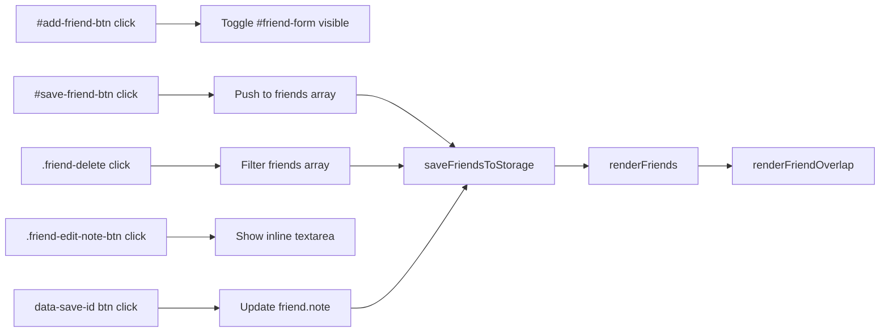
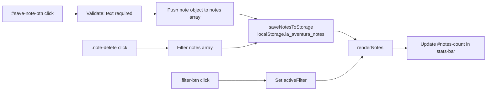

# Frontend — UI Structure, CSS System, Event Wiring

---

## index.html DOM Structure

`index.html` uses a SPA-style layout. Only one `.page-section` has `.active` at a time. `showSection(id)` in `app.js` (~line 1455) switches sections.

```
<body>
  <div id="ambient-bg">              — animated gradient background, changes per section

  <aside id="sidebar">               — collapsible left sidebar (desktop) / slide-in (mobile)
    .sidebar-header                  — logo + close button (#sidebar-close)
    nav.sidebar-nav                  — links, each .sidebar-nav-item[data-section]
    .sidebar-footer                  — planner link + flag emojis

  <div id="sidebar-overlay">         — mobile tap-outside-to-close overlay

  <div id="main-wrapper">
    <header id="site-header">        — sticky topbar
      button#sidebar-toggle          — hamburger
      .topbar-logo                   — globe + title
      .topbar-actions                — button#theme-toggle

    <main id="main-content">

      ── SECTION 1: HOME / MAP ──────────────────────────────────
      <section id="map-section" class="page-section active">
        <div id="map">               — Leaflet map target
        .map-overlay-title           — "🌎" + #map-overlay-stats text
        #countdown-widget            — live countdown / trip day counter
        button#tour-play-btn         — starts tour mode
        button#story-mode-btn        — (story mode trigger)
        .map-style-toggle            — dark/light/satellite/globe buttons
        #globe-container             — hidden 3D globe overlay
        .map-legend                  — #legend-peru, #legend-brazil, #legend-argentina
        #tour-panel.hidden           — compact tour overlay (visible during playback)
          .tp-emoji / .tp-city / .tp-sub / .tp-act
          #tp-prev / #tp-pause / #tp-next / #tp-exit

      <section.stats-bar id="stats-bar">   — shown alongside home section only
        #stat-days / #stat-countries / #stat-cities / #stat-budget-day / #notes-count

      ── SECTION 2: DESTINATIONS ───────────────────────────────
      <section id="destinos">
        .leg-tabs                    — button.leg-tab[data-leg] × 3
        #cards-container             — .dest-card.flip-card elements injected by renderCards()

      ── SECTION 3: TRAVEL BUDDIES ─────────────────────────────
      <section id="amigos">
        #friends-container           — .friend-card elements injected by renderFriends()
        button#add-friend-btn
        #friend-form.hidden          — add-friend form fields
        #friend-overlap-wrap         — #friend-overlap-chart

      ── SECTION 4: TRIP TIMELINE ──────────────────────────────
      <section id="timeline-section">
        #timeline-container          — .timeline-grid injected by buildTimeline()
        #timeline-detail.hidden      — click-to-expand day detail panel

      ── SECTION 5: TRAVEL STATS ───────────────────────────────
      <section id="stats-dash">
        #stats-counters              — stat pills
        .heatmap-grid #heatmap-grid  — nights-per-city heatmap
        #dist-table-body             — distance table rows

      ── SECTION 6: BUDGET TRACKER ─────────────────────────────
      <section id="budget">
        .live-tools-strip            — currency converter + world clocks
        .budget-overview             — total card + leg bars
        .budget-charts               — SVG donut, pace chart, timeline chart
        .budget-table-wrap           — per-city table
        .insights-panel              — smart insights
        .budget-expenses-section     — actual expenses form + list

      ── SECTION 7: PACKING LIST ───────────────────────────────
      <section id="packing">

      ── SECTION 8: CULTURE HUB ────────────────────────────────
      <section id="culture">

      ── SECTION 9: DAILY JOURNAL ──────────────────────────────
      <section id="journal">

    <footer class="site-footer">    — at bottom of main-content

  <script src="tripdata.js">        — MUST be first script tag
  <script src="app.js">
```

---

## CSS Variable Reference

Defined in `style.css` `:root` (lines 1–45).

### Colors

| Variable | Value | Used for |
|---|---|---|
| `--peru` | `#E8834A` | Peru leg — terracotta orange |
| `--peru-dark` | `#c0612a` | Peru hover states |
| `--brazil` | `#22a447` | Brazil leg — jungle green |
| `--brazil-dark` | `#176b30` | Brazil hover |
| `--argentina` | `#5b9bd5` | Argentina leg — Andean blue |
| `--argentina-dark` | `#3a74aa` | Argentina hover |
| `--dark` | `#0d1117` | Page background |
| `--dark-2` | `#161b22` | Header, sidebar background |
| `--dark-3` | `#21262d` | Card backgrounds, borders |
| `--dark-4` | `#2d333b` | Input backgrounds |
| `--light` | `#f8f5f0` | Light mode background |
| `--light-2` | `#ede8e1` | Light mode surface |
| `--text` | `#f1f5f9` | Primary text |
| `--text-muted` | `#94a3b8` | Secondary text, labels |
| `--text-dark` | `#1e293b` | Text in light mode |
| `--accent` | `#f59e0b` | Amber accent — flight arcs, highlights |
| `--white` | `#ffffff` | — |

> **Note:** JS files (`app.js`, `planner.js`) define `LEGS` / `LEGS_META` with slightly different hex values (`#E8834A`, `#22a447`, `#5b9bd5`). These match CSS but are defined independently — update both if changing leg colors.

### Spacing / Shape

| Variable | Value |
|---|---|
| `--radius` | `12px` |
| `--radius-lg` | `20px` |
| `--shadow` | `0 4px 20px rgba(0,0,0,0.3)` |
| `--shadow-lg` | `0 10px 40px rgba(0,0,0,0.4)` |

### Fonts

| Variable | Value |
|---|---|
| `--font-head` | `'Playfair Display', Georgia, serif` |
| `--font-body` | `'Inter', -apple-system, sans-serif` |

Both loaded from Google Fonts CDN in `index.html` `<head>`.

---

## Design Conventions

### Dark theme (default)
Background `#0d1117`, surfaces `#161b22` / `#21262d`. White text `#f1f5f9`.

### Light mode
Toggled by `body.light-mode` class. `style.css` ~line 270 overrides `--dark*` and `--text*` variables. Persisted to `la_aventura_theme` localStorage key.

### Gradient text (headings)
```css
background: linear-gradient(135deg, var(--peru), var(--accent), var(--brazil));
-webkit-background-clip: text;
-webkit-text-fill-color: transparent;
background-clip: text;
```
**Flag emojis inside a gradient-text element go invisible** because `-webkit-text-fill-color: transparent` applies to them too. Fix: wrap flags in `<span style="-webkit-text-fill-color:initial;background:none">`. See [CONVENTIONS.md](CONVENTIONS.md).

### Section layout (SPA pattern)
All `<section class="page-section">` are rendered but only the active one is shown. CSS hides non-active sections. `showSection(id)` toggles `.active` class and invalidates the Leaflet map size when navigating to home.

### Responsive / mobile breakpoints
- Sidebar collapses at `≤768px` — becomes a slide-in drawer.
- `#sidebar-toggle` (hamburger) always visible; behavior differs desktop vs mobile.
- `.hamburger` class used in old header (now replaced by `.topbar`).

### Scroll animations
`.anim-ready` elements start invisible (`opacity:0; transform:translateY(30px)`). They gain `.anim-visible` when `showSection()` runs for that section.

---

## Event Wiring Map

### Navigation

| Element | Event | Handler | Effect |
|---|---|---|---|
| `.sidebar-nav-item` | `click` | `showSection(item.dataset.section)` | Switches visible section |
| `#sidebar-toggle` | `click` | `initSideNav()` inner fn | Opens/closes sidebar |
| `#sidebar-close` | `click` | `closeSidebar()` | Closes sidebar |
| `#sidebar-overlay` | `click` | `closeSidebar()` | Closes sidebar (mobile) |
| `#theme-toggle` | `click` | `initThemeToggle()` | Toggles `body.light-mode` |

### Tour Mode

| Element | Event | Handler | Effect |
|---|---|---|---|
| `#tour-play-btn` | `click` | `initTourMode()` entry point | Starts tour, adds `tour-active` to body |
| `#tp-pause` | `click` | `pauseAutoPlay()` / `startAutoPlay()` | Toggles playback |
| `#tp-next` | `click` | `showStop(currentIdx+1, true, false)` | Advances to next stop |
| `#tp-prev` | `click` | `showStop(currentIdx-1, false, true)` | Goes back, removes last drawn segment |
| `#tp-exit` | `click` | `exitTour()` | Cleans up tour, resets map |
| `keydown ArrowRight/Left/Space/Esc` | `keydown` | same as btn clicks | Keyboard tour control |

### Friends



### Notes



### Destination Cards

| Element | Event | Handler | Effect |
|---|---|---|---|
| `.leg-tab` | `click` | `renderCards(tab.dataset.leg)` | Re-renders cards for leg |
| `.dest-card` | `click` | toggle `.flipped` class | Flips card to show back side |
| `.flip-fly-btn` | `click` | `showSection('map-section')` + `map.flyTo(coords)` | Navigates to map and flies to city |

---

## Leaflet Map Details

`initMap()` in `app.js` (~line 160).

| Setting | Value |
|---|---|
| Initial center | `[-20, -60]` (central South America) |
| Initial zoom | `4` |
| Tile provider | CartoDB Dark (`dark_all`) |
| CDN | `https://unpkg.com/leaflet@1.9.4/dist/leaflet.css` |

### Route drawing sequence
1. **Dashed white polyline** — entire route (`rgba(255,255,255,0.35)`, dashArray `8,8`), animated first (SVG stroke-dashoffset trick, delay 0).
2. **Colored leg polylines** — Peru `#E8834A`, Brazil `#22a447`, Argentina `#5b9bd5`, drawn with staggered delays (1200ms, 3000ms, 5000ms).
3. **Curved flight arcs** — amber dashed (`#f59e0b`), drawn between stops where `leg` changes (inter-country transitions). Uses quadratic Bezier `curvedArc()`. ✈️ divIcon placed at arc midpoint.
4. **City markers** — custom `divIcon` per stop: colored circle + emoji + numbered badge + CSS pulse ring (`@keyframes mapPulse`).

### Map style switching
Three tile configs in `TILE_LAYERS` object inside `initMap()`: `dark` (CartoDB), `light` (CartoDB Light), `satellite` (Esri World Imagery). Switched by `setTileLayer(style)`.

### Tour mode map interaction
Tour mode adds `body.tour-active` class (CSS expands map to fullscreen). `travelerMarker` is a `divIcon` with a rotated ✈️ emoji. `animateTraveler()` uses `requestAnimationFrame` with cubic ease-in-out to interpolate position between stops. Each segment drawn as a bright `L.polyline`. `map.flyTo()` follows the traveler with a slight lag.

### `window._mapInstance`
`initMap()` exposes the Leaflet map as `window._mapInstance`. Used by destination card "Fly to on map" buttons to call `map.flyTo()` from outside `initMap()`.
